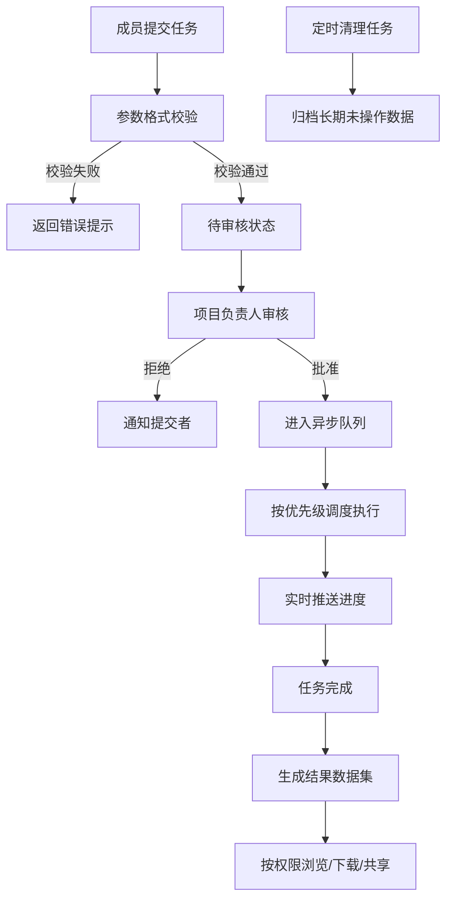

## 1. 产品概述

数值仿真任务管理平台是面向科研团队的多用户协作平台，解决科学计算任务的提交、调度、执行与结果管理问题，支持三种角色协同工作，实现计算资源高效利用与科研数据有序管理。

- 核心目标：提升科研团队数值仿真任务的协作效率，确保计算任务可追溯、可监控、可复用
- 目标用户：科研团队管理员、项目负责人、普通科研成员

## 2. 核心功能

### 2.1 用户角色

| 角色 | 注册方式 | 核心权限 |
|------|----------|----------|
| 管理员 | 系统预置 | 用户权限分配、系统配置管理、全局数据浏览 |
| 项目负责人 | 管理员创建 | 项目创建与管理、任务审核、组内成员管理、项目数据统计 |
| 普通成员 | 管理员创建/自助注册 | 任务提交、参数配置、任务监控、结果浏览下载 |

### 2.2 功能模块

1. **登录认证页**：JWT登录、角色识别、权限路由
2. **仪表板页**：任务概览、统计图表、快捷操作、最新通知
3. **项目管理页**：项目列表、项目详情、成员管理、项目统计
4. **任务管理页**：任务列表、任务提交、参数配置、进度监控、任务审核
5. **结果管理页**：结果列表、结果详情、数据可视化、下载分享
6. **消息中心页**：站内消息、系统通知、消息标记已读
7. **参数模板页**：参数模板管理、模板创建编辑、校验规则配置
8. **用户管理页（管理员）**：用户列表、角色分配、权限配置
9. **系统设置页**：系统配置、清理策略、存储管理

### 2.3 页面详情

| 页面名称 | 模块名称 | 功能描述 |
|----------|----------|----------|
| 登录认证页 | 登录表单 | 用户名密码登录、JWT令牌获取、错误提示 |
| 仪表板页 | 统计概览 | 任务状态饼图、趋势折线图、项目任务分布 |
| 仪表板页 | 快捷操作 | 快速提交任务、最近任务列表、未读消息提醒 |
| 项目管理页 | 项目列表 | 项目卡片展示、搜索筛选、创建项目入口 |
| 项目管理页 | 项目详情 | 项目信息、成员列表、关联任务、操作按钮 |
| 任务管理页 | 任务列表 | 表格展示、状态标签、优先级标记、筛选排序 |
| 任务管理页 | 任务提交 | 表单向导、参数动态表单、模型文件上传、实时校验 |
| 任务管理页 | 任务详情 | 进度条、运行日志、参数展示、操作按钮 |
| 任务管理页 | 任务审核 | 审核弹窗、批准/拒绝、审核意见填写 |
| 结果管理页 | 结果列表 | 结果卡片、元数据展示、下载/分享按钮 |
| 结果管理页 | 结果详情 | 数据可视化图表、原始数据预览、版本历史 |
| 消息中心页 | 消息列表 | 分类标签、已读/未读状态、批量操作 |
| 参数模板页 | 模板管理 | 模板列表、模板编辑器、校验规则配置 |
| 用户管理页 | 用户列表 | 用户表格、角色分配、状态管理、搜索筛选 |
| 系统设置页 | 配置管理 | 清理周期设置、存储配额、通知偏好 |

## 3. 核心流程

### 3.1 任务提交流程
普通成员选择项目 → 填写任务基本信息 → 选择参数模板 → 配置任务参数（实时校验）→ 上传模型文件 → 提交任务 → 进入待审核队列

### 3.2 任务审核流程
项目负责人查看待审核任务 → 查看任务详情与参数 → 批准/拒绝并填写意见 → 任务状态更新 → 通知提交者

### 3.3 任务执行流程
已批准任务进入异步队列 → 按优先级调度 → 开始执行 → 实时推送进度 → 完成/失败 → 生成结果 → 自动通知

### 3.4 结果管理流程
任务完成生成结果 → 关联提交者与项目 → 支持按权限浏览 → 可下载/共享 → 长期未访问自动归档

## 4. 用户界面设计

### 4.1 设计风格
- **主色调**：科技蓝 (#1890ff) 作为主色，深灰 (#1f1f1f) 作为深色背景
- **辅助色**：成功绿 (#52c41a)、警告橙 (#faad14)、错误红 (#ff4d4f)
- **按钮风格**：圆角设计，主按钮使用渐变效果，悬停有微妙阴影变化
- **字体**：主标题使用 "Noto Sans SC"，正文使用系统字体，代码和数据展示使用等宽字体 "JetBrains Mono"
- **布局风格**：左侧导航栏 + 顶部面包屑 + 主内容区，卡片式组件布局，适度留白
- **图标风格**：使用 lucide-react 线性图标，统一尺寸和配色

### 4.2 页面设计概览

| 页面名称 | 模块名称 | UI元素 |
|----------|----------|--------|
| 登录页 | 登录表单 | 渐变背景、玻璃拟态卡片、动画输入框、品牌Logo |
| 仪表板 | 统计卡片 | 数字动画、图标装饰、悬停上浮效果 |
| 仪表板 | 图表区 | ECharts图表、渐变色填充、交互提示框 |
| 任务列表 | 数据表格 | 斑马纹、状态标签、操作列悬停显示、分页器 |
| 任务提交 | 表单向导 | 步骤指示器、动态表单字段、实时校验反馈 |
| 任务详情 | 进度监控 | 环形进度条、日志滚动面板、状态时间线 |
| 结果详情 | 数据可视化 | 可交互图表、数据网格、下载按钮组 |

### 4.3 响应式设计
- 桌面端优先设计，针对 1920px 和 1440px 宽度优化
- 平板端（≥768px）：导航栏可折叠，表格可横向滚动
- 移动端（<768px）：底部标签栏导航，卡片式列表，简化操作

### 4.4 交互动效
- 页面加载：骨架屏占位，内容渐入显示
- 表格行：悬停背景色变化，点击高亮反馈
- 按钮：点击缩放效果，加载状态动画
- 通知：右上角滑入动画，未读红点闪烁
- 进度条：平滑过渡动画，状态变更闪烁提示
