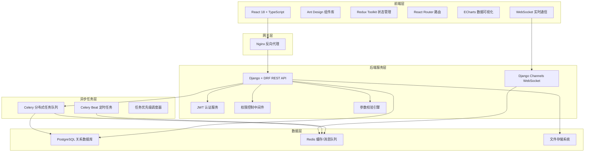
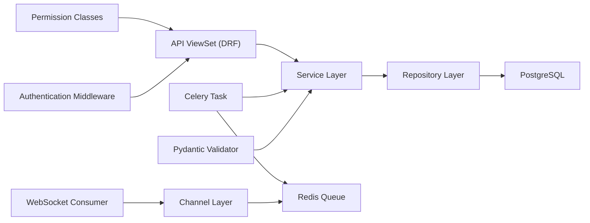
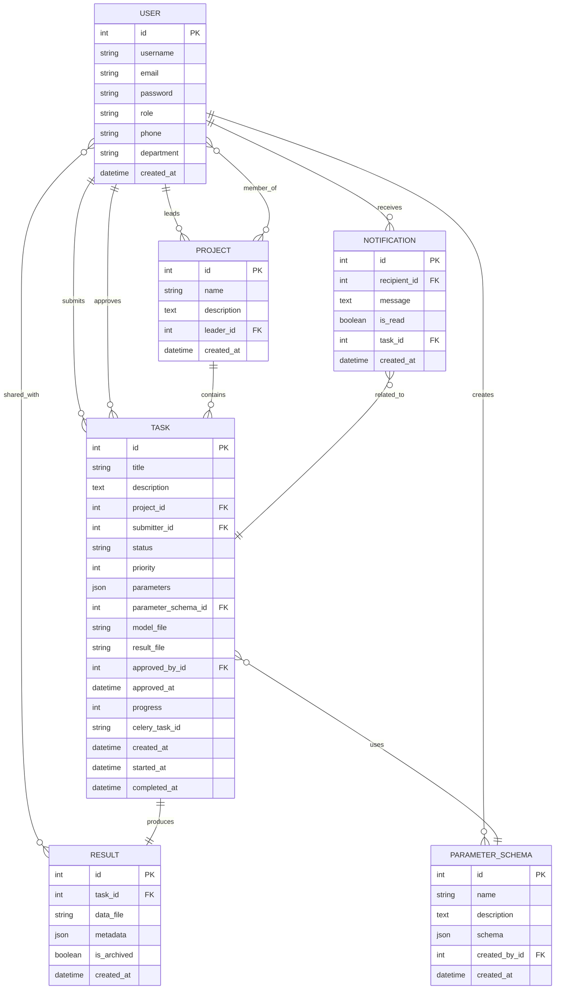

## 1. 架构设计



## 2. 技术描述

- **前端**：React 18 + TypeScript + Vite 构建
- **UI组件库**：Ant Design 5.x + lucide-react 图标
- **状态管理**：Redux Toolkit + RTK Query
- **路由**：React Router v6
- **数据可视化**：ECharts 5.x
- **HTTP客户端**：Axios + 请求拦截器
- **后端**：Django 4.2 + Django REST Framework 3.14
- **实时通信**：Django Channels + WebSocket
- **异步任务**：Celery 5.3 + Redis
- **数据库**：PostgreSQL 15
- **缓存/消息队列**：Redis 7
- **认证**：djangorestframework-simplejwt
- **参数校验**：Pydantic 2.x
- **容器化**：Docker + Docker Compose

## 3. 路由定义

| 路由 | 页面组件 | 权限要求 | 说明 |
|------|----------|----------|------|
| /login | Login | 公开 | 登录页面 |
| / | Dashboard | 已认证 | 仪表板首页 |
| /projects | ProjectList | 已认证 | 项目列表 |
| /projects/:id | ProjectDetail | 项目成员 | 项目详情 |
| /tasks | TaskList | 已认证 | 任务列表 |
| /tasks/create | TaskCreate | 普通成员 | 创建任务 |
| /tasks/:id | TaskDetail | 任务相关方 | 任务详情与监控 |
| /results | ResultList | 已认证 | 结果列表 |
| /results/:id | ResultDetail | 权限用户 | 结果详情与可视化 |
| /messages | MessageCenter | 已认证 | 消息中心 |
| /schemas | SchemaList | 项目负责人 | 参数模板管理 |
| /users | UserManagement | 管理员 | 用户管理 |
| /settings | SystemSettings | 管理员 | 系统设置 |

## 4. API 定义

### 4.1 TypeScript 类型定义

```typescript
interface User {
  id: number;
  username: string;
  email: string;
  role: 'admin' | 'leader' | 'member';
  phone?: string;
  department?: string;
  date_joined: string;
}

interface Project {
  id: number;
  name: string;
  description: string;
  leader: User;
  members: User[];
  created_at: string;
  task_count: number;
}

interface Task {
  id: number;
  title: string;
  description: string;
  project: number;
  submitter: User;
  status: 'pending' | 'approved' | 'rejected' | 'running' | 'completed' | 'failed' | 'archived';
  priority: 1 | 2 | 3 | 4 | 5;
  parameters: Record<string, any>;
  parameter_schema: number | null;
  model_file?: string;
  result_file?: string;
  approved_by?: User;
  approved_at?: string;
  progress: number;
  created_at: string;
  started_at?: string;
  completed_at?: string;
}

interface Result {
  id: number;
  task: Task;
  data_file: string;
  metadata: Record<string, any>;
  shared_with: User[];
  is_archived: boolean;
  created_at: string;
}

interface Notification {
  id: number;
  recipient: number;
  message: string;
  is_read: boolean;
  task?: number;
  created_at: string;
}

interface ParameterSchema {
  id: number;
  name: string;
  description: string;
  schema: {
    fields: Array<{
      name: string;
      type: 'int' | 'float' | 'string' | 'bool' | 'array';
      required: boolean;
      default?: any;
      range?: { min?: number; max?: number };
      options?: any[];
      pattern?: string;
    }>;
  };
  created_by: User;
  created_at: string;
}
```

### 4.2 API 端点

| 方法 | 路径 | 说明 | 权限 |
|------|------|------|------|
| POST | /api/auth/login | 用户登录获取Token | 公开 |
| POST | /api/auth/refresh | 刷新Token | 已认证 |
| GET | /api/auth/me | 获取当前用户信息 | 已认证 |
| GET | /api/users/ | 用户列表 | 管理员 |
| POST | /api/users/ | 创建用户 | 管理员 |
| PUT | /api/users/:id/ | 更新用户信息 | 管理员 |
| GET | /api/projects/ | 项目列表 | 已认证 |
| POST | /api/projects/ | 创建项目 | 项目负责人 |
| GET | /api/projects/:id/ | 项目详情 | 项目成员 |
| POST | /api/projects/:id/members/ | 添加项目成员 | 项目负责人 |
| GET | /api/tasks/ | 任务列表 | 已认证 |
| POST | /api/tasks/ | 提交任务 | 普通成员 |
| GET | /api/tasks/:id/ | 任务详情 | 任务相关方 |
| POST | /api/tasks/:id/review/ | 审核任务 | 项目负责人 |
| POST | /api/tasks/:id/retry/ | 重试失败任务 | 提交者/负责人 |
| GET | /api/results/ | 结果列表 | 已认证 |
| GET | /api/results/:id/download/ | 下载结果 | 权限用户 |
| POST | /api/results/:id/share/ | 共享结果 | 结果所有者 |
| GET | /api/notifications/ | 消息列表 | 已认证 |
| PUT | /api/notifications/:id/read/ | 标记已读 | 接收者 |
| POST | /api/notifications/read-all/ | 全部标记已读 | 已认证 |
| GET | /api/schemas/ | 参数模板列表 | 已认证 |
| POST | /api/schemas/ | 创建参数模板 | 项目负责人 |
| POST | /api/schemas/validate/ | 校验参数 | 已认证 |

## 5. 服务器架构图



## 6. 数据模型

### 6.1 ER 图



### 6.2 索引设计

```sql
-- 用户表索引
CREATE INDEX idx_user_role ON users_user(role);
CREATE INDEX idx_user_department ON users_user(department);

-- 项目表索引
CREATE INDEX idx_project_leader ON projects_project(leader_id);
CREATE INDEX idx_project_created_at ON projects_project(created_at);

-- 任务表索引
CREATE INDEX idx_task_status ON tasks_task(status);
CREATE INDEX idx_task_priority ON tasks_task(priority);
CREATE INDEX idx_task_project ON tasks_task(project_id);
CREATE INDEX idx_task_submitter ON tasks_task(submitter_id);
CREATE INDEX idx_task_created_at ON tasks_task(created_at);
CREATE INDEX idx_task_status_priority ON tasks_task(status, priority) WHERE status = 'approved';

-- 结果表索引
CREATE INDEX idx_result_task ON results_result(task_id);
CREATE INDEX idx_result_archived ON results_result(is_archived);
CREATE INDEX idx_result_created_at ON results_result(created_at);

-- 消息表索引
CREATE INDEX idx_notification_recipient ON notifications_notification(recipient_id);
CREATE INDEX idx_notification_read ON notifications_notification(is_read);
CREATE INDEX idx_notification_created_at ON notifications_notification(created_at);

-- 参数模板表索引
CREATE INDEX idx_schema_created_by ON tasks_parameterschema(created_by_id);
```
